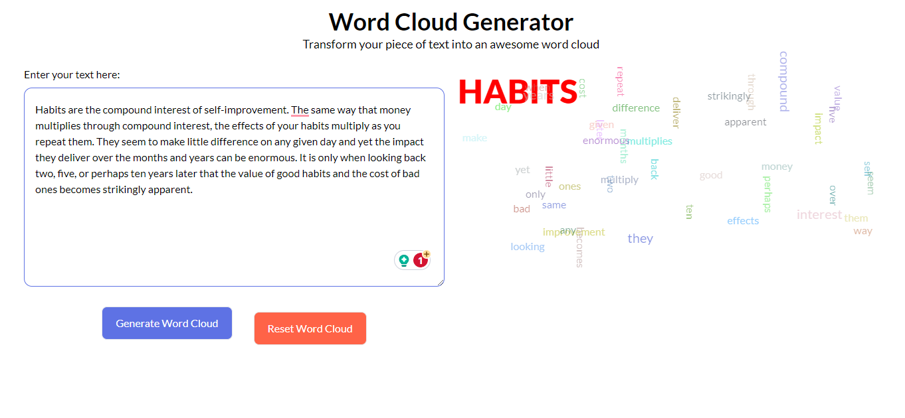

# WORD CLOUD GENERATOR

This app generates a visual word cloud from input text, displaying keywords based on frequency.

<!-- Add Image here -->



## Table of Contents

- [Description](#description)
- [Features](#features)
- [Installation](#installation)
- [Usage](#usage)
- [Demo](#demo)
  <!-- - [Technologies](#technologies) -->
  <!-- - [Process](#process) -->
- [Improvement](#improvement)
- [Contributing](#contributing)
- [License](#license)

## Description

The Word Cloud Generator is a React component that takes user-inputted text and generates a visual representation of word frequency in the form of a word cloud. The component provides customization options such as font size, color, and rotation for each word in the cloud.

## Features

- Input text box for user to enter or paste text content
- Word cloud generation based on word frequency.
- Adjustable font size, color, and rotation.
- Centering the word with the highest frequency.
- Uppercase and margin for the word with the highest frequency.
- Reset functionality to clear the input and generated word cloud.

## Installation

1. Clone the repository

   ```bash
   git clone https://github.com/Boluwatife-AJB/word-cloud-generator.git
   ```

2. Change into the project directory:

   ```bash
   cd word-cloud-generator-v1
   ```

3. Install dependencies:

   ```bash
    npm install
   ```

4. Run the Vite development server:

   ```bash
   npm run dev
   ```

   This will start the development server, and you can view the Word Cloud Generator in your browser at `http://localhost:5173`.

## Usage

<!-- 1. Import the WordCloudGenerator component into your React application.

   ```bash
    import WordCloudGenerator from './path/to/WordCloudGenerator';
   ```

2. Add the `WordCloudGenerator` component to your JSX.

   ```bash
    <WordCloudGenerator />
   ```

3. Customize the component based on your requirements. -->

1. Paste or type text into input box
2. Press 'Generate Word Cloud' button
3. See visual word cloud populate with keywords
4. Click reset to clear and enter new text

Font size of each word represents its frequency - most used words are largest.

## Demo

You can preview the live project [here](https://word-cloud-generator-v1.vercel.app/)

<!--TODO:  Add a link to video or add a video file or gif to show how it works -->

## Improvement

Some possible enhancements for the future:

- Make word cloud update live as user types instead of requiring button click.
- Improved responsive layout and sizing.
- Highlight or categorize words by part of speech.
- Add more customization like themes, implement dark and light themes.
- Refactor Code.

## Contributing

If you would like to contribute to the development of this project, please follow the guidelines in [Contribution guidelines](CONTRIBUTING.md)

## License

This project is licensed under the [MIT License](LICENSE). Feel free to use, modify, and distribute this code for educational or commercial purposes.
